# SWIFT Hyperledger Besu Settlement Network

A SWIFT-inspired interbank settlement network built on Hyperledger Besu using QBFT consensus, Solidity smart contracts, and enterprise-grade observability tooling.

This project demonstrates how approved financial institutions can participate in a permissioned blockchain network, execute interbank settlements, monitor validator health, inspect transactions through a blockchain explorer, and observe network activity through Grafana, Prometheus, and Loki.

**Author:** Jake Kantor  
**GitHub:** [github.com/kantorkid](https://github.com/kantorkid)  
**Contact:** jake.t.kantor@gmail.com

---

## Why Hyperledger Besu

Hyperledger Besu is the recommended enterprise Ethereum client for financial infrastructure. It runs on both private permissioned networks and public EVM-compatible chains using the same stack:

- **Private network** — permissioned QBFT consensus for interbank settlement with instant finality
- **Public chain compatibility** — EVM compatibility preserves optionality for stablecoin and CBDC bridge integration
- **Enterprise-grade privacy** — Tessera integration enables private transactions visible only to counterparties
- **Regulatory alignment** — permissioned node and account allowlisting satisfies compliance requirements for financial institutions

QBFT was chosen over IBFT 2.0 as the recommended enterprise consensus protocol for new deployments.

---

## System Architecture



The full stack spans a React operations dashboard, Solidity smart contract layer, four-node QBFT private network, and a Prometheus/Grafana/Loki monitoring stack.

---

## Settlement Flow



Approved banks execute settlement through the smart contract. Unauthorized wallets are rejected at the contract layer before any funds move.

---

## Network Configuration

| Parameter | Value |
|-----------|-------|
| Consensus | QBFT (Quorum Byzantine Fault Tolerant) |
| Validators | 4 |
| Chain ID | 1337 |
| Block time | 2 seconds |
| Finality | Instant — Byzantine fault tolerant |

---

## Demonstration Results

### BOA → BOC settlement

```
Sender:      Bank of America (0xFE3B557E8Fb62b89F4916B721be55cEb828dBd73)
Recipient:   Bank of China (0x627306090abaB3A6e1400e9345bC60c78a8BEf57)
Result:      Successful: true
Block:       1411
Gas used:    39,928
TX hash:     0xe87e45285ad40e9d43105c0e03603cce3fd9647c75fe1255a283e7887f553b01
```

### BOC → BOA settlement

```
Sender:      Bank of China (0x627306090abaB3A6e1400e9345bC60c78a8BEf57)
Recipient:   Bank of America (0xFE3B557E8Fb62b89F4916B721be55cEb828dBd73)
Result:      Successful: true
Block:       1412
Gas used:    39,928
TX hash:     0xbc5f7e8565b341ec790c8d810d3e498cef2e904e94ebd32d674692f4b06465a5
```

### Hacker → BOA (rejected)

```
Sender:      Hacker wallet (0xf17f52151EbEF6C7334FAD080c5704D77216b732)
Recipient:   Bank of America
Result:      Successful: false
Reason:      Execution reverted (Only Approved Banks can perform this function.)
```

### Hacker → BOC (rejected)

```
Sender:      Hacker wallet (0xf17f52151EbEF6C7334FAD080c5704D77216b732)
Recipient:   Bank of China
Result:      Successful: false
Reason:      Execution reverted (Only Approved Banks can perform this function.)
```

---

## Features

### Permissioned banking network

- SWIFT operator-controlled governance
- Bank approval and removal workflow
- Approved and rejected participant tracking
- On-chain institution registry
- Permissioned settlement execution

### Settlement processing

- Bank-to-bank settlement transfers
- Payment reference support
- On-chain audit trail
- Finalized transaction history
- Event-driven settlement tracking

### Operations dashboard

- Network status visibility
- Latest block and peer count monitoring
- Approved and rejected bank registry
- Bank liquidity monitoring
- Settlement execution controls
- Embedded Chainlens explorer
- MetaMask integration

### Monitoring and observability

- Prometheus metrics collection
- Grafana dashboards
- Loki log aggregation
- Promtail log shipping
- Validator health and consensus monitoring

---

## Smart Contract

The network is governed by the `SwiftHyperledgerBesu` contract deployed on the private Besu network.

### Core functions

| Function | Access | Description |
|----------|--------|-------------|
| `approveBank(address)` | SWIFT operator only | Adds a bank to the approved registry |
| `removeBank(address)` | SWIFT operator only | Revokes bank access |
| `transferToBank(address)` | Approved banks only | Executes settlement between approved banks |
| `getApprovedBanks()` | Public | Returns approved bank registry |

### Access control

```solidity
modifier onlyApprovedBanks(address bank) {
    require(
        approvedBanks[bank],
        "Only Approved Banks can transact on the SWIFT network."
    );
    _;
}
```

---

## Permission Layers

### Layer 1 — Network permissioning (Besu)

- **Node allowlisting** — only approved nodes may join the validator network
- **Account allowlisting** — only approved accounts may submit transactions

### Layer 2 — Smart contract permissioning

- **Bank approval** — SWIFT operator must explicitly approve each bank
- **Bank removal** — SWIFT operator can revoke bank access
- **Approved-bank-only transfers** — unauthorized addresses are rejected with explicit error messages

---

## Security Controls

| Layer | Control | Implementation |
|-------|---------|---------------|
| Network | Byzantine fault tolerance | QBFT — tolerates 1 faulty node of 4 |
| Network | Node allowlisting | Unauthorized nodes cannot connect |
| Network | Account allowlisting | Unauthorized accounts cannot transact |
| Contract | Operator role | SWIFT administrator controls bank registry |
| Contract | Access control | `onlyOperator` and `onlyApprovedBank` modifiers |
| Contract | Audit trail | All events emitted on-chain — immutable |

---

## Technology Stack

| Category | Technology |
|----------|-----------|
| Blockchain client | Hyperledger Besu |
| Consensus | QBFT |
| Smart contracts | Solidity 0.8.20 |
| Development framework | Hardhat |
| Blockchain interaction | Ethers.js |
| Frontend | React + Vite |
| Wallet | MetaMask |
| Metrics | Prometheus |
| Dashboards | Grafana |
| Log aggregation | Loki + Promtail |
| Explorer | Chainlens |
| Infrastructure | Docker + Docker Compose |
| Runtime | Node.js |

---

## Project Structure

```
SWIFT_hyperledger_besu/
├── contracts/
│   └── SwiftHyperledgerBesu.sol
├── scripts/
│   ├── deploy.js
│   ├── start-network.sh
│   ├── stop-network.sh
│   ├── reset-network.sh
│   ├── transfer.js
│   └── demoTransfers.js
├── frontend/
│   ├── src/
│   ├── package.json
│   └── vite.config.js
├── monitoring/
│   ├── docker-compose.yml
│   ├── prometheus.yml
│   ├── loki-config.yml
│   └── promtail-config.yml
├── docs/
│   ├── swift_besu_system_architecture.svg
│   └── swift_settlement_flow.svg
├── Node-1/
├── Node-2/
├── Node-3/
├── Node-4/
└── README.md
```

---

## Installation

```bash
git clone https://github.com/kantorkid/SWIFT_hyperledger_besu.git
cd SWIFT_hyperledger_besu
npm install
cd frontend && npm install && cd ..
```

---

## Network Commands

```bash
npm run start-network    # Start all 4 QBFT nodes
npm run stop-network     # Stop all nodes
npm run reset-network    # Reset chain state
npm run rebuild          # Compile contracts
npm run deploy-besu      # Deploy to private network
npm run fresh-start      # Clean environment and restart
```

---

## Dashboard

```bash
cd frontend
npm run dev
```

Open `http://localhost:5173`

---

## Monitoring Stack

```bash
cd monitoring
docker compose up -d
```

| Service | URL |
|---------|-----|
| Grafana | http://localhost:3001 |
| Prometheus | http://localhost:9090 |
| Loki | http://localhost:3100 |
| Chainlens Explorer | http://localhost |

---

## MetaMask Configuration

| Setting | Value |
|---------|-------|
| Network name | QBFT Local |
| RPC URL | http://127.0.0.1:8545 |
| Chain ID | 1337 |
| Currency symbol | ETH |

---

## Relevance to SWIFT Infrastructure

**Cross-border settlement** — atomic settlement between counterparty banks mirrors SWIFT GPI's settlement confirmation guarantees.

**Permissioned validator network** — QBFT with four validators mirrors the consortium model where only approved financial institutions operate network nodes.

**Compliance by design** — account and node allowlisting enforces regulatory requirements at the infrastructure layer.

**Audit trail** — immutable on-chain event logging provides the transparent transaction history required for regulatory reporting and dispute resolution.

**ISO 20022 alignment** — the settlement workflow models the structured financial messaging standard SWIFT is migrating to globally.

---

## Future Enhancements

- Tessera integration for private transactions between counterparties
- Multi-signature settlement approval
- Cross-currency atomic swap using Chainlink Price Feeds
- Stablecoin and CBDC settlement support
- KYC/AML verification integration
- Sanctions screening simulation
- OpenTelemetry integration
- Settlement analytics dashboard
- Role-based administration

---

## License

GPL-3.0
